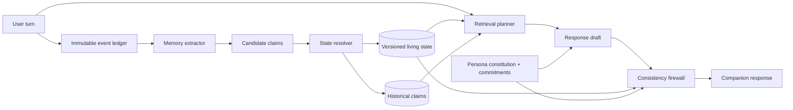

# Companion Memory Core

A research prototype for **persistent, temporally correct memory and persona consistency in AI companions**.

> Thesis: long-term companion memory is a **state-management problem with retrieval**, not a vector-search problem with a prompt.

## Why this exists
Long-running assistants often fail in two visibly damaging ways: they retrieve stale personal facts and they drift out of character. This project treats those as explicit systems problems rather than hoping a larger context window or a longer system prompt will solve them.

The architecture separates immutable conversational evidence from versioned current beliefs, then combines state-aware retrieval with persona consistency checks.

## Architecture



## What is intentionally different
- **History is append-only; beliefs are versioned.** A breakup does not erase that the relationship existed.
- **Contradiction is typed.** Correction, temporal transition, coexistence, and supersession are different operations.
- **Decay affects accessibility, not truth.** Stable facts do not expire just because they are old.
- **Persona has state too.** The companion's own first-person commitments can become future consistency obligations.
- **Evaluation is component-level.** We want to know whether a failure came from extraction, state resolution, retrieval, temporal reasoning, or generation.

## Current phase
Phase 0/1 scaffold: research specification, schemas, SQLite persistence, deterministic state-transition primitives, retrieval interfaces, persona constitution, and evaluation schema.

The next implementation milestone is the structured LLM extractor/resolver and a runnable end-to-end CLI.

## Install

```bash
python -m venv .venv
source .venv/bin/activate
pip install -e '.[dev]'
```

## Run tests

```bash
pytest -q
```

## Inspect the research contract
Read [`SKILL.md`](SKILL.md) first. It is the governing build/evaluation specification for this repository.

## Repository map

```text
src/companion_memory/   core implementation
eval/                   scenario definitions + evaluation harness
research/               literature notes and design implications
docs/                   architecture and ADRs
tests/                  deterministic behavior tests
data/                    local runtime data (ignored except .gitkeep)
```

## Research anchors
The design is informed by LongMemEval, LoCoMo, LoCoMo-Plus, MemGPT, Mem0, Zep/Graphiti, and recent persona-consistency work. See [`research/literature.md`](research/literature.md) for the specific takeaways we adopt—and the ideas we deliberately do not copy.
